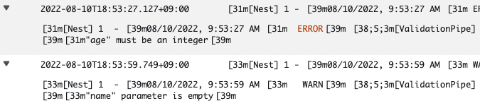

# Dashboard

## Logging

- Logger  
  아래와 같은 구성의 로그 기록
  
- Alert
  - ERROR level 의 로그의 경우, slack 으로 전송
  - WARN level 의 로그의 경우, slack 으로 전송하지 않음

## Monitoring

- Object
  - CPU(DB/Server) usage graph
  - response
    - total count(total/per unit)
    - error count(total/per unit)
    - average/max time
- Method
  - AWS CloudWatch

## Alerting

- Object
  - CPU/Memory Utilization
  - Logger alerts
- Method
  - alert 발생 시, slack 으로 전송
  - slack message 에 포함 된 detail link 를 클릭 시, 해당 alert 에 대한 상세 내용 확인 가능
